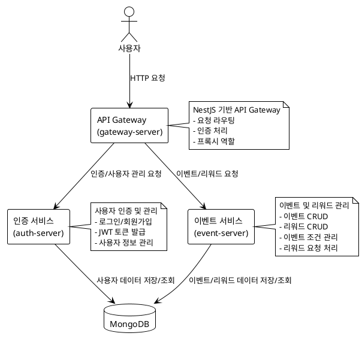

# 리워드 플랫폼 (Rewards Platform)

리워드 플랫폼은 이벤트 기반 리워드 시스템을 구현한 마이크로서비스 아키텍처 애플리케이션입니다. 사용자가 특정 조건을 충족하면 리워드를 요청하고 받을 수 있는 시스템을 제공합니다.

## 아키텍처 다이어그램



## Docker Compose로 실행하기

### 사전 요구사항

- Docker 및 Docker Compose가 설치되어 있어야 합니다.

### 실행 방법

1. 저장소를 클론합니다:

```bash
git clone https://github.com/your-username/rewards-platform.git
cd rewards-platform
```

2. Docker Compose로 서비스를 실행합니다:

```bash
docker-compose up -d
```

3. 서비스 상태를 확인합니다:

```bash
docker-compose ps
```

4. 서비스에 접근합니다:
  - Gateway API: http://localhost:3000
  - Auth API: http://localhost:3001
  - Event API: http://localhost:3002

5. 서비스를 중지하려면:

```bash
docker-compose down
```

## 프로젝트 구현 설명

### 이벤트 설계

이벤트 시스템은 다음과 같은 구조로 설계되었습니다:

1. **이벤트(Event)**: 사용자가 참여할 수 있는 프로모션 또는 캠페인을 나타냅니다.
  - 각 이벤트는 이름, 설명, 시작일, 종료일, 상태(활성/비활성) 등의 속성을 가집니다.
  - 이벤트는 여러 개의 조건(Condition)과 리워드(Reward)를 가질 수 있습니다.

2. **이벤트 조건(EventCondition)**: 사용자가 리워드를 받기 위해 충족해야 하는 조건을 정의합니다.
  - 조건 유형: 로그인 일수, 친구 초대, 프로필 완성, 커스텀 조건 등
  - 각 조건은 필요한 횟수(requiredCount)를 가지고 있어 조건 충족 기준을 정의합니다.

3. **리워드(Reward)**: 조건을 충족한 사용자에게 제공되는 보상을 나타냅니다.
  - 각 리워드는 이름, 설명, 수량 등의 속성을 가집니다.

4. **리워드 요청(RewardRequest)**: 사용자가 리워드를 요청하는 프로세스를 관리합니다.
  - 상태 관리: 요청됨(REQUESTED) → 승인됨(APPROVED) → 완료됨(COMPLETED) 또는 거부됨(REJECTED)
  - 중복 요청 방지를 위한 멱등성 키(idempotency key) 사용

### 조건 검증 방식

현재 구현에서는 조건 검증이 단순화되어 있습니다:

1. 사용자가 리워드를 요청할 때, 시스템은 다음 사항을 검증합니다:
  - 이벤트가 활성 상태인지 확인
  - 리워드가 해당 이벤트에 속하는지 확인
  - 이벤트에 조건이 정의되어 있는지 확인
  - 사용자가 이미 동일한 이벤트와 리워드에 대한 요청을 했는지 확인

2. 실제 조건 충족 여부 검증은 현재 구현에서 자동 승인되도록 되어 있습니다. 실제 프로덕션 환경에서는 다음과 같은 방식으로 확장할 수 있습니다:
  - 사용자 활동 로그를 기반으로 조건 충족 여부 검증
  - 외부 시스템과 연동하여 조건 검증 (예: 로그인 이력, 친구 초대 이력 등)
  - 조건 유형별 검증 로직 구현

### API 구조 선택 이유

마이크로서비스 아키텍처를 선택한 이유:

1. **관심사 분리**: 인증과 이벤트/리워드 관리를 별도의 서비스로 분리하여 각 도메인에 집중할 수 있습니다.
2. **확장성**: 각 서비스를 독립적으로 확장할 수 있어 트래픽 증가에 유연하게 대응할 수 있습니다.
3. **기술 스택 유연성**: 각 서비스에 적합한 기술을 선택할 수 있습니다 (현재는 모두 NestJS 기반).
4. **장애 격리**: 한 서비스의 장애가 전체 시스템에 영향을 미치지 않도록 합니다.

API Gateway 패턴을 사용한 이유:

1. **단일 진입점**: 클라이언트는 하나의 엔드포인트만 알면 모든 서비스에 접근할 수 있습니다.
2. **인증 중앙화**: 모든 요청에 대한 인증을 게이트웨이에서 처리합니다.
3. **요청 라우팅**: 클라이언트 요청을 적절한 마이크로서비스로 라우팅합니다.
4. **API 조합**: 여러 마이크로서비스의 응답을 조합하여 클라이언트에 제공할 수 있습니다.

### 구현 중 겪은 고민

1. **도메인 모델 설계**: 이벤트, 조건, 리워드 간의 관계를 어떻게 설계할지 고민했습니다. 최종적으로 이벤트를 중심으로 조건과 리워드를 연결하는 구조를 선택했습니다.

2. **상태 관리**: 리워드 요청의 상태 전이를 어떻게 관리할지 고민했습니다. 상태 전이 규칙을 명확히 정의하고 검증하는 로직을 구현했습니다.

3. **중복 요청 방지**: 사용자가 동일한 리워드를 여러 번 요청하는 것을 방지하기 위해 멱등성 키를 도입했습니다.

4. **데이터베이스 인덱싱**: MongoDB 컬렉션에 적절한 인덱스를 설정하여 쿼리 성능을 최적화했습니다. 특히 자주 조회되는 필드(userId, eventId, status 등)에 인덱스를 추가했습니다.

5. **마이크로서비스 간 통신**: 서비스 간 통신 방식으로 HTTP를 선택했습니다. 향후 확장 시 메시지 큐(RabbitMQ, Kafka 등)를 도입하여 비동기 통신을 구현할 수 있습니다.

## 기술 스택

- **백엔드**: NestJS (TypeScript)
- **데이터베이스**: MongoDB
- **컨테이너**: Docker, Docker Compose
- **테스트**: Jest
